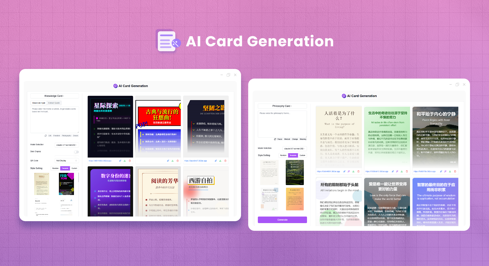
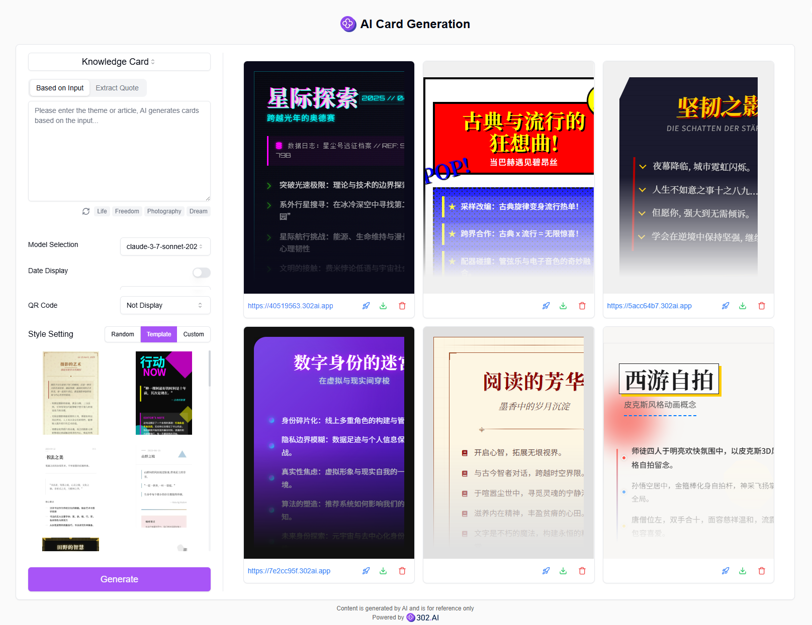
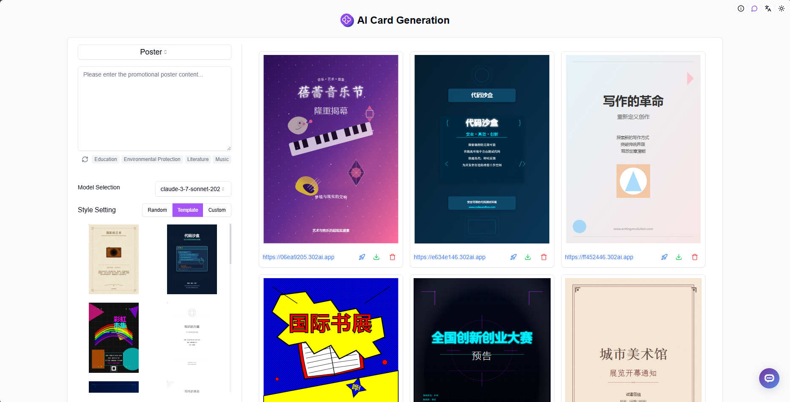
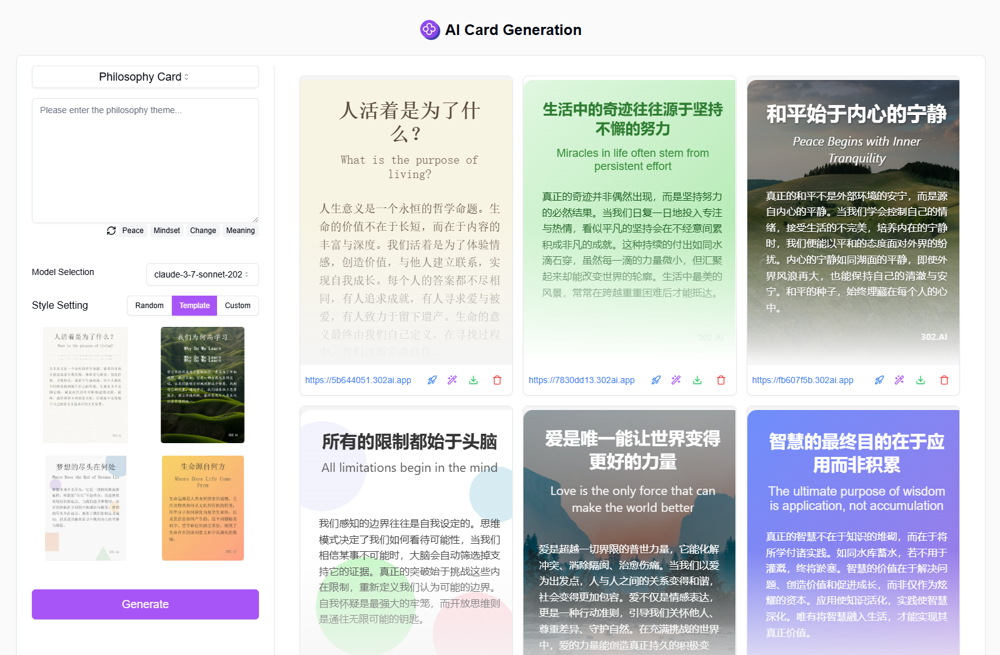
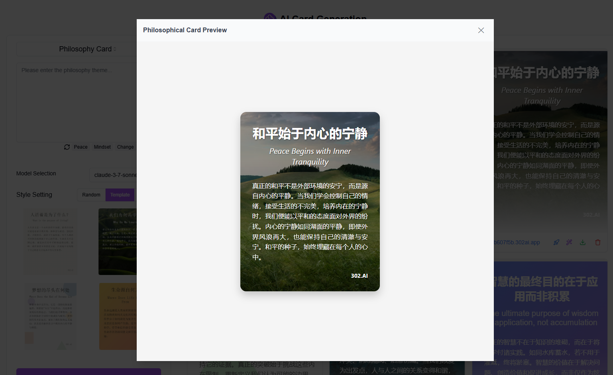
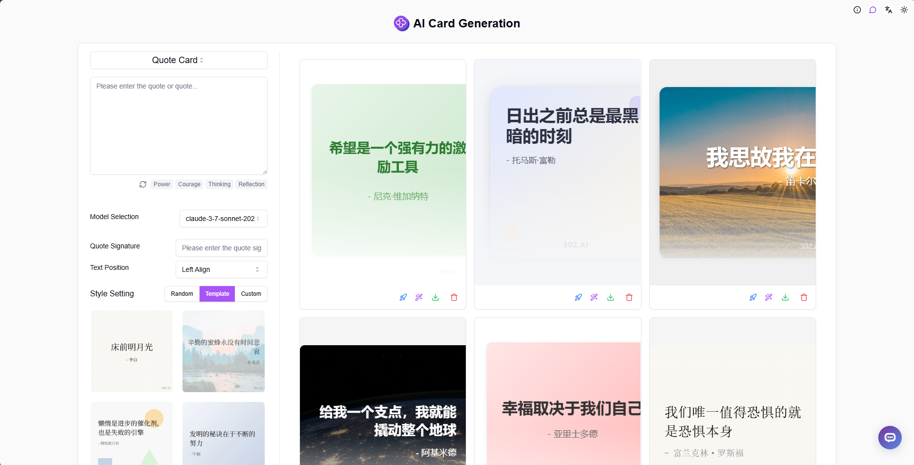
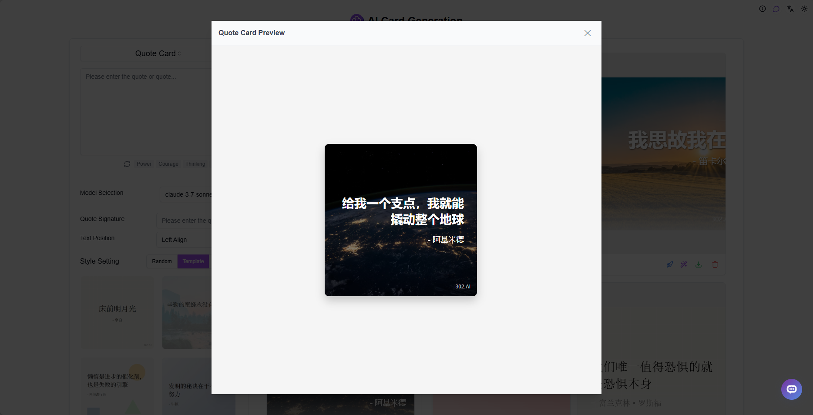

# <p align="center"> 🎴 AI Card Generation 🚀✨</p>

<p align="center">AI Card Generation uses AI to generate various types of cards, including knowledge cards, promotional posters, philosophical cards, quote cards, and more.</p>

<p align="center"><a href="https://302.ai/product/detail/67" target="blank"></a></p >

<p align="center"><a href="README_zh.md">中文</a> | <a href="README.md">English</a> | <a href="README_ja.md">日本語</a></p>



This is the open-source version of the [AI Card Generation](https://302.ai/product/detail/67) from [302.AI](https://302.ai/en/). You can directly log in to 302.AI to use the online version with zero code and zero background, or modify and deploy it yourself according to your requirements.

## Interface Preview

Multiple model selections are available, supporting date display and QR code presentation, along with various style templates. You can also randomly generate or customize card styles. Input keywords or articles to generate knowledge cards using AI based on input or extracted article quotes.  


This is a preview of the knowledge card, supporting online style editing, one-click deployment, and viewing of the deployed interface.  


Enter prompts to generate promotional posters using AI.  


Input philosophical themes to generate philosophical cards using AI.  


This is a preview of the philosophical card.  


Multiple model selections are available, supporting text layout selection, along with various style templates. You can also randomly generate or customize card styles. Input quotes or sayings, add attribution, and use AI to generate quote cards.


This is a preview of the quote card.


## Project Features

### 🎨 Diverse Card Generation

Support for generating various types of cards including knowledge cards, promotional posters, philosophical cards, and quote cards.

### 📝 Intelligent Content Extraction

Automatically analyze article content, extract key quotes, and generate precise card content.

### 🎯 Custom Templates

Provide rich preset templates while supporting customizable styles and layouts.

### 🔄 One-Click Deployment

Support quick preview and one-click deployment functionality.

### ✏️ Online Editing

Support online editing of card styles.

### 🌍 Multi-language Support

- Chinese Interface
- English Interface
- Japanese Interface

## 🚩 Future Update Plans

- [ ] Support for more card types
- [ ] Add more style templates

## 🛠️ Tech Stack

- **Framework**: Next.js 14
- **Language**: TypeScript
- **Styling**: TailwindCSS
- **UI Components**: Radix UI
- **State Management**: Jotai
- **Form Handling**: React Hook Form
- **HTTP Client**: ky
- **i18n**: next-intl
- **Theming**: next-themes
- **Code Standards**: ESLint, Prettier
- **Commit Standards**: Husky, Commitlint

## Development & Deployment

1. Clone the project

```bash
git clone https://github.com/302ai/302_ai_card_generation
cd 302_ai_card_generation
```

2. Install dependencies

```bash
pnpm install
```

3. Configure environment

```bash
cp .env.example .env.local
```

Modify the environment variables in `.env.local` as needed.

4. Start development server

```bash
pnpm dev
```

5. Build for production

```bash
pnpm build
pnpm start
```

## ✨ About 302.AI ✨

[302.AI](https://302.ai/en/) is an enterprise-oriented AI application platform that offers pay-as-you-go services, ready-to-use solutions, and an open-source ecosystem.✨

1. 🧠 Comprehensive AI capabilities: Incorporates the latest in language, image, audio, and video models from leading AI brands.
2. 🚀 Advanced application development: We build genuine AI products, not just simple chatbots.
3. 💰 No monthly fees: All features are pay-per-use, fully accessible, ensuring low entry barriers with high potential.
4. 🛠 Powerful admin dashboard: Designed for teams and SMEs - managed by one, used by many.
5. 🔗 API access for all AI features: All tools are open-source and customizable (in progress).
6. 💡 Powerful development team: Launching 2-3 new applications weekly with daily product updates. Interested developers are welcome to contact us.
