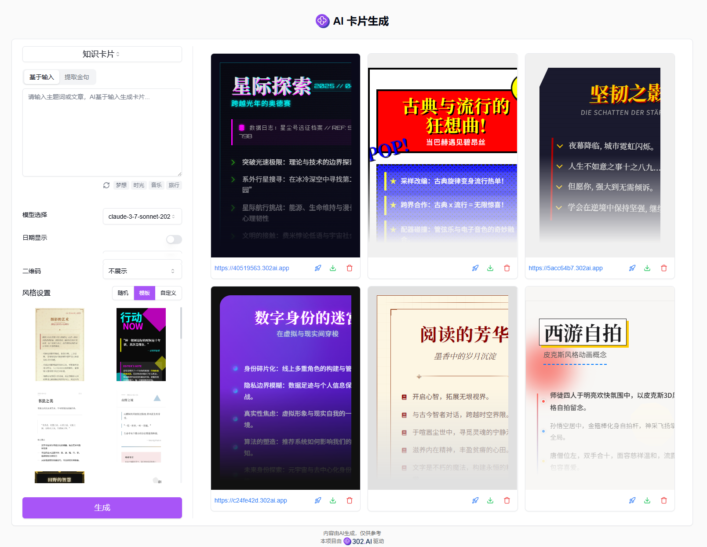
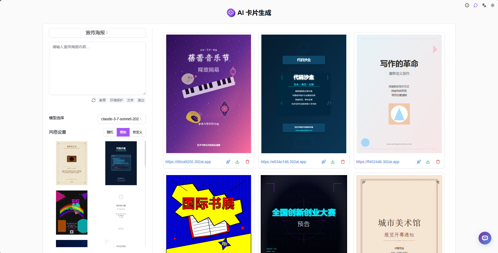
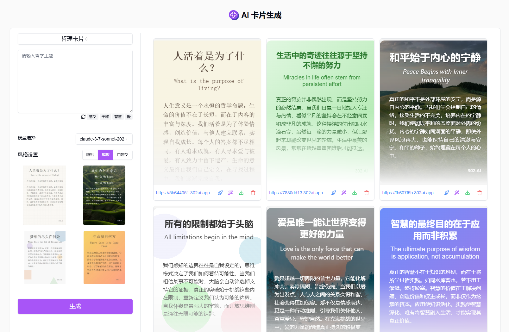
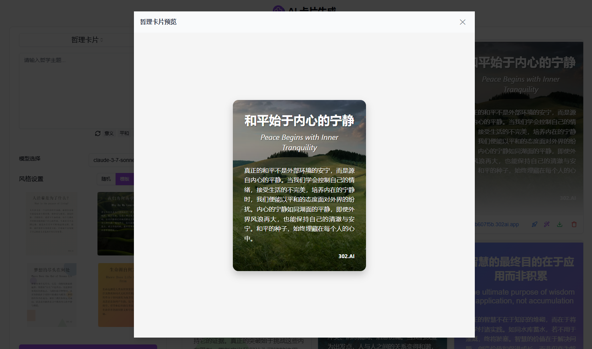
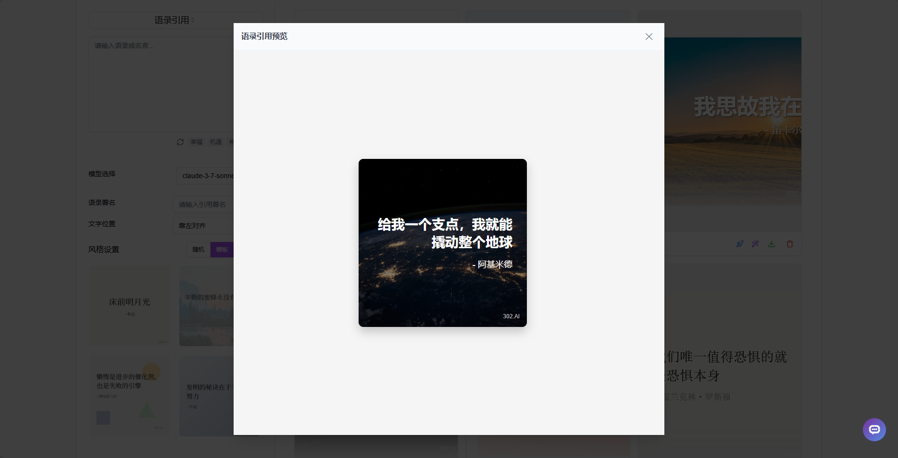

# <p align="center"> 🎴 AI 卡片生成 🚀✨</p>

<p align="center">AI卡片生成使用AI生成多种类型的卡片，包括知识卡片、宣传海报、哲理卡片、语录引用等。</p>

<p align="center"><a href="https://302.ai/tools/card/" target="blank"></a></p >

<p align="center"><a href="README_zh.md">中文</a> | <a href="README.md">English</a> | <a href="README_ja.md">日本語</a></p>


来自[302.AI](https://302.ai)的[AI 卡片生成](https://302.ai/tools/card/)的开源版本。你可以直接登录302.AI，零代码零配置使用在线版本。或者对本项目根据自己的需求进行修改，传入302.AI的API KEY，自行部署。

## 界面预览

提供多个模型选择，支持日期显示和二维码展示，同时提供了多种风格模板，您也可以随机生成或自定义卡片风格。输入主题词或文章，即可使用AI基于输入或基于提取文章金句来生成知识卡片。  


这是知识卡片的预览效果，支持在线编辑样式，支持一键部署并查看部署后的界面。  


输入提示词，即可使用AI生成宣传海报。  


输入哲学主题，即可使用AI生成哲理卡片。  


这是哲理卡片的预览效果。  


提供多个模型选择，支持选择文字布局，同时提供了多种风格模板，您也可以随机生成或自定义卡片风格。输入语录或名言，填写语录署名，即可使用AI生成语录引用卡片。


这是语录引用的预览效果。


## 项目特性

### 🎨 多样化卡片生成

支持知识卡片、宣传海报、哲理卡片、语录引用等多种类型卡片的生成。

### 📝 智能内容提取

自动分析文章内容，提取金句，生成精准的卡片内容。

### 🎯 自定义模板

提供丰富的预设模板，同时支持自定义风格和布局。

### 🔄 一键部署

支持卡片的快速预览和一键部署功能。

### ✏️ 在线编辑

支持在线编辑卡片样式。

### 🌍 多语言支持

- 中文界面
- English Interface
- 日本語インターフェース

## 🚩 未来更新计划

- [ ] 支持更多卡片类型
- [ ] 新增更多风格模板

## 🛠️ 技术栈

- **框架**: Next.js 14
- **语言**: TypeScript
- **样式**: TailwindCSS
- **UI组件**: Radix UI
- **状态管理**: Jotai
- **表单处理**: React Hook Form
- **HTTP客户端**: ky
- **国际化**: next-intl
- **主题**: next-themes
- **代码规范**: ESLint, Prettier
- **提交规范**: Husky, Commitlint

## 开发&部署

1. 克隆项目

```bash
git clone https://github.com/302ai/302_ai_card_generation
cd 302_ai_card_generation
```

2. 安装依赖

```bash
pnpm install
```

3. 环境配置

```bash
cp .env.example .env.local
```

根据需要修改 `.env.local` 中的环境变量。

4. 启动开发服务器

```bash
pnpm dev
```

5. 构建生产版本

```bash
pnpm build
pnpm start
```

## ✨ 302.AI介绍 ✨

[302.AI](https://302.ai)是一个按需付费的AI应用平台，为用户解决AI用于实践的最后一公里问题。

1. 🧠 集合了最新最全的AI能力和品牌，包括但不限于语言模型、图像模型、声音模型、视频模型。
2. 🚀 在基础模型上进行深度应用开发，我们开发真正的AI产品，而不是简单的对话机器人
3. 💰 零月费，所有功能按需付费，全面开放，做到真正的门槛低，上限高。
4. 🛠 功能强大的管理后台，面向团队和中小企业，一人管理，多人使用。
5. 🔗 所有AI能力均提供API接入，所有工具开源可自行定制（进行中）。
6. 💡 强大的开发团队，每周推出2-3个新应用，产品每日更新。有兴趣加入的开发者也欢迎联系我们
